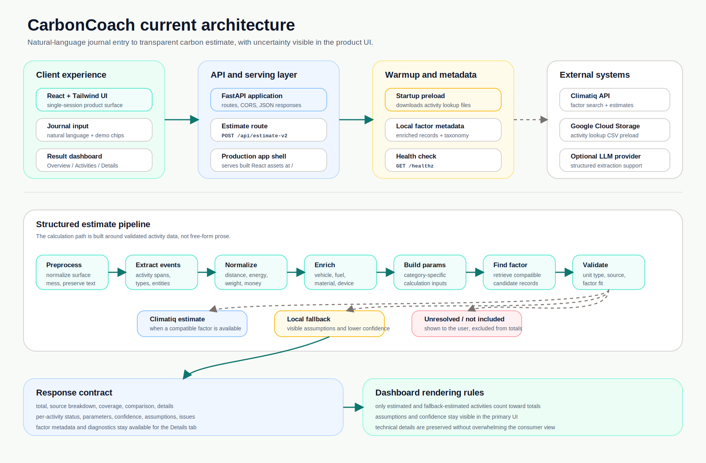

# CarbonCoach

CarbonCoach is an AI-assisted carbon journaling app.

You write what you did in plain English. CarbonCoach breaks the entry into carbon-relevant activities, estimates what it safely can, and shows the assumptions, confidence, and gaps behind the result.

Live demo: https://carbon-coach.vercel.app/

```text
Used a 2 kW heater for 3 hours, drove 7 km, bought coffee, and recycled 500 g of plastic.
```

This is not trying to be audit-grade carbon accounting. It is a product experiment in making personal carbon awareness feel fast, understandable, and honest.

## Why I Built This

Most carbon calculators make users choose from long forms. That works for clean data, but it is a bad fit for how people actually remember their day.

The interesting problem is not just "can an LLM understand a sentence?" It is:

- Can the app split one messy journal entry into separate carbon activities?
- Can it normalize quantities like `7k`, `500g`, `2 kW`, and `$20`?
- Can it preserve useful details like vehicle type, fuel, appliance, material, or purchase context?
- Can it avoid pretending an estimate is complete when something important is missing?
- Can the UI explain uncertainty without feeling like a debug console?

CarbonCoach is my answer to that product and engineering problem.

## What It Does

- Accepts natural-language daily journal entries.
- Extracts multiple activities from a single entry.
- Estimates supported transport, energy, goods, and waste activities.
- Keeps unresolved and not-estimated activities visible instead of dropping them.
- Shows confidence at the total and per-activity level.
- Explains assumptions in user-facing language.
- Provides a polished result dashboard with `Overview`, `Activities`, and `Details`.
- Keeps technical diagnostics available for reviewers without putting them in the primary UI.

## The Demo Story

1. Type or select a messy daily journal entry.
2. CarbonCoach estimates the footprint it can support.
3. The Overview tab shows the result in a few seconds.
4. The Activities tab shows how the day was decomposed.
5. The Details tab proves there is real engineering behind the output.

The key product behavior is that CarbonCoach does not hide uncertainty. If the app needs more detail, it says so.

## Architecture

The current CarbonCoach architecture has three visible layers:

- a React/Tailwind journal interface
- a FastAPI serving and estimate layer
- a structured carbon-estimation pipeline with explicit confidence, assumptions, and coverage

```text
journal text
-> conservative preprocessing
-> structured event extraction
-> quantity normalization
-> entity enrichment
-> category-specific parameter builders
-> factor retrieval
-> factor compatibility validation
-> Climatiq estimate or local fallback
-> totals, coverage, confidence, assumptions, issues, diagnostics
-> React dashboard
```

The React production build is copied into the FastAPI container, so the deployed backend can serve the same UI users see at `/`.



[Open the interactive architecture diagram](https://embed.figma.com/board/kX98y4jqZsddzK0aoZVJat/CarbonCoach-Architecture?node-id=0-1&embed-host=share)

## Engineering Decisions

### 1. How should messy journal text become calculable data?

**Design question:** A journal entry is unstructured, but emissions calculations require structured activity data. How do you avoid reducing everything to broad labels like `transport` or `energy`?

**Approach:** I treated the journal as a source of activity evidence, not as a label to classify. Before estimating, CarbonCoach turns the text into structured carbon events. Each event keeps the raw text span alongside a controlled activity type, quantities, entities, assumptions, issues, and confidence.

That distinction matters for inputs like:

```text
I drove 7 km.
I drove 7 km in a petrol car.
I drove 7 km in an electric SUV.
I took a 7k ride in a Toyota Camry.
```

Those examples are all "transport," but they should not produce the same calculation path.

### 2. Where should AI stop and deterministic code take over?

**Design question:** LLMs are useful for interpreting language, but carbon estimates need validation, units, factors, and confidence boundaries. How do you keep the model helpful without letting it invent calculations?

**Approach:** I used the model where it is strongest: interpreting messy language into candidate structure. The calculation path is deliberately less flexible. Before anything reaches an emissions estimate, it goes through:

- Pydantic schema validation
- controlled category and activity enums
- deterministic quantity normalization
- entity enrichment
- parameter builders
- factor compatibility checks
- confidence scoring

If the extracted data is incomplete or unsafe, the system would rather surface that uncertainty than hide it. The activity becomes `unresolved`, `not_estimated`, `failed`, or a visible fallback estimate instead of being silently forced into a calculation.

### 3. How should the app handle incomplete or uncertain estimates?

**Design question:** Real journal entries often omit important details. Should the app block the user, guess silently, or return a partial result?

**Approach:** I chose an estimate-first flow because blocking on follow-up questions would make journaling feel heavy. The tradeoff is that uncertainty has to be part of the product surface, not an afterthought. Each estimated activity can expose:

- parameter confidence
- factor confidence
- source confidence
- overall estimate confidence

Only these statuses count toward totals and category charts:

```text
estimated
fallback_estimated
```

These do not:

```text
unresolved
failed
not_estimated
```

This lets the app stay useful for quick reflection while still making it clear when the number is only a partial estimate.

### 4. How do you make technical uncertainty understandable in the UI?

**Design question:** A raw response with factor IDs, confidence scores, issue codes, and assumptions is useful to engineers but overwhelming to most users.

**Approach:** I separated the UI into layers. The default experience answers the questions a user has first: how much was estimated, what drove it, how complete is it, and what would improve it? The technical evidence stays available one tab deeper instead of competing with the main result.

The result summary is deterministic. It can mention supported facts like largest category, top activity, partial coverage, confidence bottlenecks, or next useful clarification. It does not call an LLM to generate coaching prose, and it avoids unsupported claims such as avoided emissions or exact accuracy.

## UI Design

The UI is meant to feel like a consumer product, not a JSON viewer.

The result area is split into three tabs:

- `Overview`: total estimate, quality, coverage, category breakdown, and summary.
- `Activities`: estimated activities, assumptions, missing details, and not-included activities.
- `Details`: confidence breakdowns, parameters, factor diagnostics, assumptions, issues, comparison metadata, and raw JSON.

Some deliberate UI choices:

- No login, history, timeline, or persistence.
- Example chips populate the input but never fake results.
- Category colors stay consistent between the donut chart and category cards.
- Confidence uses green, yellow, and red text and surfaces.
- Primary UI stays consumer-friendly.
- Technical evidence stays available without overwhelming the default view.

## Backend Modules

| Area | Files | Purpose |
| --- | --- | --- |
| FastAPI app | `app/app.py` | API routes, warmup state, health check, React serving. |
| Estimate pipeline | `app/pipeline_v2/pipeline.py` | End-to-end orchestration for current estimates. |
| Domain models | `app/domain/models.py` | Pydantic contracts for events, estimates, coverage, confidence, and diagnostics. |
| Taxonomy | `app/domain/activity_taxonomy.py` | Controlled activity families and policies. |
| Extraction | `app/pipeline_v2/event_extractor.py` | Deterministic event extraction. |
| Optional LLM extraction | `app/pipeline_v2/llm_event_extractor.py` | Structured LLM extraction with fallback. |
| Normalization | `app/pipeline_v2/quantity_normalizer.py` | Unit and quantity normalization. |
| Enrichment | `app/pipeline_v2/entity_enricher.py` | Vehicle, material, appliance, and entity enrichment. |
| Parameter builders | `app/pipeline_v2/parameter_builders.py` | Category-specific calculation parameters. |
| Factor retrieval | `app/pipeline_v2/factor_retriever.py` | Local/remote factor candidate retrieval. |
| Validation | `app/pipeline_v2/validator.py` | Factor and parameter compatibility checks. |
| Fallbacks | `app/pipeline_v2/fallback_estimator.py` | Maintained local fallback estimates. |
| Frontend | `app/frontend/src` | React/Tailwind product UI. |

## API

### Estimate

```http
POST /api/estimate-v2
Content-Type: application/json
```

```json
{
  "journal": "I used a 2 kW heater for 3 hours and recycled 500 g of plastic."
}
```

The response includes:

- `total`
- `coverage`
- `comparison`
- `details[]`
- activity `status`
- normalized `parameters`
- `confidence`
- `parameter_confidence`
- `factor_confidence`
- `source_confidence`
- `assumptions`
- `issues`
- `factor`
- `factor_diagnostics`

### Health check

```http
GET /healthz
```

Returns readiness and preload state.

## Tech Stack

| Layer | Technology |
| --- | --- |
| Backend | Python, FastAPI, Uvicorn |
| Data contracts | Pydantic |
| Frontend | React, Tailwind CSS |
| Emissions API | Climatiq |
| Embedding retrieval | ChromaDB, Sentence Transformers |
| Storage/preload | Google Cloud Storage |
| Deployment | Docker, Cloud Run-style FastAPI container, Vercel-compatible frontend config |
| Testing | Pytest, Jest, React Testing Library |

## Running Locally

Install backend dependencies:

```powershell
python -m venv venv
.\venv\Scripts\Activate.ps1
pip install -r requirements.txt
```

Set environment variables as needed:

```powershell
$env:CLIMATIQ_API_KEY="your-climatiq-key"
$env:OPENROUTER_API_KEY="your-openrouter-key"
```

Run the backend:

```powershell
uvicorn app.app:app --reload
```

Run the frontend:

```powershell
cd app/frontend
npm install
npm start
```

The frontend submits to `/api/estimate-v2` by default. You can override it with:

```powershell
$env:REACT_APP_API_BASE_URL="http://localhost:8000"
$env:REACT_APP_ESTIMATE_ENDPOINT="/api/estimate-v2"
```

## Testing

Backend:

```powershell
.\venv\Scripts\python.exe -m pytest app/tests
```

Frontend:

```powershell
cd app/frontend
$env:CI="true"
npm test -- --watchAll=false
npm run build
```

Recent frontend tests cover:

- result tabs and keyboard navigation
- coverage summary
- estimate quality
- category command center
- zero-total and unresolved-only states
- next-best clarification guidance
- demo chips
- activity cards
- confidence color treatment
- technical Details tab

## What This Shows Reviewers

CarbonCoach is not just a prompt wrapped in a UI. It demonstrates:

- turning unstructured text into validated domain objects
- keeping an AI system bounded by deterministic code
- designing for incomplete and uncertain data
- building a UI that makes uncertainty understandable
- separating consumer product experience from technical diagnostics
- deploying a React/FastAPI app through a production-like container path

## Limitations

The app is intentionally scoped.

- It is for personal awareness, not formal reporting.
- Activity coverage is still growing.
- Some activities are returned as `unresolved` or `not_estimated`.
- External provider behavior depends on configured API keys.
- There are no accounts, saved history, trends, or personalized recommendations.
- The daily comparison is broad context, not a complete personal baseline.

## Next Steps

The next useful improvements would be:

- structured clarification controls for missing details
- broader goods and waste factor coverage
- more data-backed vehicle specificity
- better regional defaults
- stronger production health/warmup behavior
- optional history only after single-entry estimation is solid

## Guiding Principle

Estimate quickly. Show uncertainty. Never hide what the system does not know.
